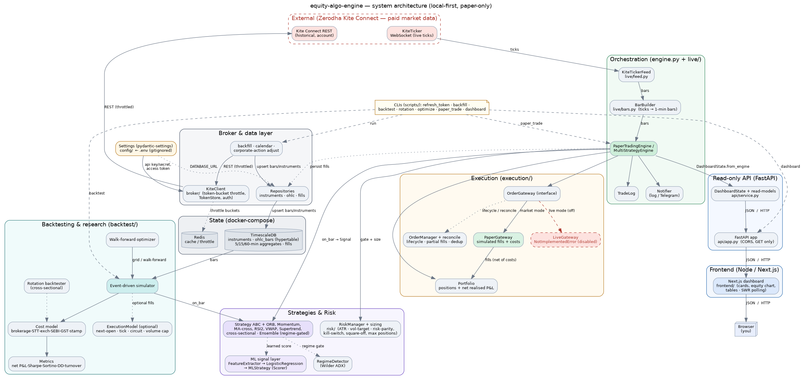
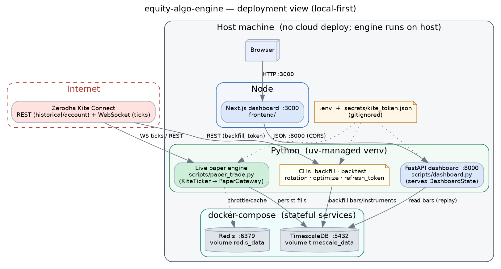
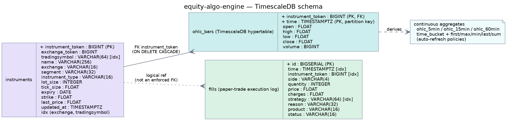
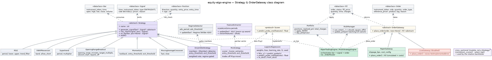

# equity-algo-engine

A **local-first** algorithmic trading system for **Indian equities (NSE/BSE)**
built on **Zerodha Kite Connect**. It generates intraday and positional signals,
backtests them with realistic transaction costs, and **paper-trades** them
against the live market.

> ⚠️ Live order execution is intentionally **out of scope** for now (it requires
> a registered static IP). The system runs in **paper mode** by default. See
> [`CLAUDE.md`](./CLAUDE.md) for the full working agreement and hard constraints,
> and [`CLAUDE_CODE_PROMPT.md`](./CLAUDE_CODE_PROMPT.md) for the complete brief
> and phased build order.

## Architecture

Full docs — Mermaid (renders inline) + rendered PNG/SVG, plus live/backtest data
flows and layer responsibilities — in [`docs/ARCHITECTURE.md`](./docs/ARCHITECTURE.md).

<table>
  <tr>
    <td align="center"><a href="docs/architecture.png"></a><br/><b>System architecture</b></td>
    <td align="center"><a href="docs/deployment.png"></a><br/><b>Deployment view</b></td>
  </tr>
  <tr>
    <td align="center"><a href="docs/schema.png"></a><br/><b>TimescaleDB schema</b></td>
    <td align="center"><a href="docs/classes.png"></a><br/><b>Strategy &amp; OrderGateway classes</b></td>
  </tr>
</table>

## Status

All phases from the brief are implemented:

- **Phase 0 — Scaffolding** — repo skeleton, env, tooling.
- **Phase 1 — Broker layer + auth** — rate-limited Kite client, daily token refresh.
- **Phase 2 — Data layer** — TimescaleDB hypertable + continuous aggregates, repositories, backfill.
- **Phase 3 — Strategy framework + backtester** — event-driven simulator, full cost model (net P&L), metrics, Opening Range Breakout.
- **Phase 4 — Risk + paper execution** — `OrderGateway`/`PaperGateway`/`LiveGateway` (stub), ATR sizing, kill-switch, square-off.
- **Phase 5 — Live paper-trading loop** — tick→bar aggregation, engine, trade log, notifier. `PaperTradingEngine` (one instrument) and `MultiStrategyEngine` (many strategies/instruments sharing one portfolio + risk budget).
- **Phase 6 — Dashboard + second strategy** — read-only FastAPI views and a positional Momentum strategy.

Live order execution remains **stubbed** (`LiveGateway` raises `NotImplementedError`).

### India-focused pro upgrades

On top of the phased build, five upgrades push the engine toward a serious
NSE/BSE setup:

1. **NSE/BSE execution realism** — an optional `ExecutionModel` for the simulator:
   next-open fills, ₹0.05 tick rounding, circuit-band clamping, and volume-
   participation caps, so backtests don't assume free, instant, unlimited fills.
2. **Volatility-target & risk-parity sizing** — `volatility_target_size` sizes a
   position to a target P&L vol; `risk_parity_sizes` (inverse-vol, with a
   water-filling weight cap) balances a multi-stock book so a smallcap and a
   largecap contribute comparable risk.
3. **Async live order manager + reconciliation** — `OrderManager` tracks the full
   order lifecycle (partial fills backed out via VWAP, dedup guard); `reconcile()`
   diffs internal vs. broker positions.
4. **Pro dashboard** — candlesticks with trade markers, a regime badge, and
   per-strategy realised P&L in the Next.js UI.
5. **Feature/ML signal layer** — a streaming `FeatureExtractor` (8 India-relevant
   features per bar), a from-scratch NumPy `LogisticRegression` + `StandardScaler`,
   a forward-return `build_dataset` labeller, and an `MLStrategy` that trades off
   the learned probability. NumPy-only, no scikit-learn; this is infrastructure
   for *finding* edge — a real model needs your own NSE/BSE history.

Plus a `RegimeDetector` (Wilder ADX) and an `EnsembleStrategy` that gates member
strategies by market regime and takes a weighted vote.

### Backtest a strategy

```bash
# Intraday Opening Range Breakout (single instrument)
uv run python scripts/backtest.py --exchange NSE --symbol INFY \
    --from 2026-01-01 --to 2026-03-31 --or-minutes 15

# Cross-sectional momentum rotation (multi-asset, positional)
uv run python scripts/rotation_backtest.py --exchange NSE \
    --symbols INFY,TCS,RELIANCE,HDFCBANK,ITC,SBIN \
    --from 2025-01-01 --to 2026-03-31 --lookback 90 --top-n 3 --rebalance-every 21
```

Strategies: `OpeningRangeBreakout` and `VWAPReversion` (intraday); `Momentum`,
`MovingAverageCrossover`, `RSI2`, and `Supertrend` (positional/trend); the
regime-aware `EnsembleStrategy` (weighted vote of members, gated by `RegimeDetector`);
and the learned `MLStrategy`. Plus a cross-sectional momentum **rotation**
backtester (`backtest.run_rotation`) that ranks a universe and holds the top names.
Optimise parameters out-of-sample with `backtest.walk_forward` (`scripts/optimize.py`).

For realistic fills, pass an `ExecutionModel` to the simulator (next-open fills,
tick rounding, circuit bands, volume caps); without one it stays byte-for-byte
compatible with the original fill-at-close path.

### Train an ML signal

The ML layer is dependency-free (NumPy only) and deterministic:

```python
from algotrading.ml import build_dataset, LogisticRegression, StandardScaler
from algotrading.strategies import MLStrategy

ds = build_dataset(bars, horizon=5, threshold=0.0)   # forward-return labels
scaler = StandardScaler().fit(ds.x)
model = LogisticRegression(n_iter=500, seed=0).fit(scaler.transform(ds.x), ds.y)

# Wrap the scaler+model in a Scorer and trade off P(up-move):
strategy = MLStrategy(instrument_token, scorer)       # plugs into the ensemble too
```

### Serve the read-only dashboard

```bash
# Zero-setup demo (synthetic data, no DB/Kite):
uv run python scripts/dashboard.py --demo
# Or replay stored bars through the paper engine:
uv run python scripts/dashboard.py --symbol INFY --from 2026-01-01 --to 2026-03-31
```

Endpoints: `GET /positions /pnl /trades /equity /attribution /candles /regimes
/strategy-pnl /closed-trades /health`. Build a state programmatically with
`DashboardState.from_engine(engine)`.

### Web UI (Next.js)

A proper dashboard UI lives in [`frontend/`](./frontend) — summary cards, a
candlestick chart with trade markers and a regime badge, an equity curve, and
live-polling tables for per-strategy P&L, closed trades, open positions, and
recent fills over the API above.

```bash
# 1. backend
uv run python scripts/dashboard.py --demo        # API on :8000
# 2. frontend
cd frontend && npm install && npm run dev         # UI on http://localhost:3000
```

## Requirements

- Python **3.12**
- [`uv`](https://docs.astral.sh/uv/) for dependency/environment management
- Docker + Docker Compose (for TimescaleDB and Redis)

## Setup

> 📖 Full step-by-step runbook: [`docs/RUNNING_LOCALLY.md`](./docs/RUNNING_LOCALLY.md)
> (prerequisites, secrets, DB, backfill, backtest, paper-trade, dashboard,
> troubleshooting).

```bash
# 1. Install dependencies (runtime + dev) into a managed virtualenv
uv sync

# 2. Configure secrets and connection strings
cp .env.example .env
#   then edit .env and fill in your Kite Connect API key/secret

# 3. Start the stateful services (TimescaleDB + Redis)
docker compose up -d

# 4. Wire up the commit hooks (gitleaks + ruff)
uv run pre-commit install
```

### Verify the services are healthy

```bash
docker compose ps        # both services should report (healthy)
```

## Development

```bash
uv run ruff check .              # lint
uv run ruff format --check .     # format check
uv run pytest -v                 # tests
```

CI (`.github/workflows/ci.yml`) runs gitleaks secret scanning, ruff, and pytest
against a real TimescaleDB + Redis on every push/PR to `main`. All Kite/broker
calls are mocked — **no live API access in CI**.

## Project layout

```
.
├── config/                 # pydantic-settings configuration
├── src/algotrading/
│   ├── broker/             # Kite wrapper, token refresh, throttle   (Phase 1)
│   ├── data/               # ingestion, backfill, DB models          (Phase 2)
│   ├── strategies/         # Strategy base + impls, regime, ensemble,
│   │                       #   features.py, ml_strategy.py           (Phase 3+)
│   ├── ml/                 # NumPy logistic scorer, scaler, dataset
│   ├── backtest/           # simulator + execution model + cost model (Phase 3)
│   ├── execution/          # OrderGateway, Paper/LiveGateway,
│   │                       #   order_manager.py, reconcile.py        (Phase 4)
│   ├── risk/               # ATR / vol-target / risk-parity sizing,
│   │                       #   stop-loss, kill-switch                (Phase 4)
│   ├── api/                # read-only FastAPI dashboard service
│   └── engine.py           # orchestrator (paper/live wiring)
├── frontend/               # Next.js dashboard UI
├── scripts/                # refresh_token.py, backfill.py, dashboard.py, ...
├── migrations/             # alembic versions
└── tests/
```

## Safety & compliance

- **Personal use only** — no multi-client, signal-selling, or distribution
  features.
- **Secrets never touch git** — `.env`, tokens, sessions, and data dumps are
  gitignored; gitleaks enforces this on every commit and in CI.
- **Backtests report net P&L** after brokerage, STT, exchange/SEBI charges, GST,
  stamp duty, and slippage.
- **No real orders** — `LiveGateway` stays stubbed until explicitly enabled.
