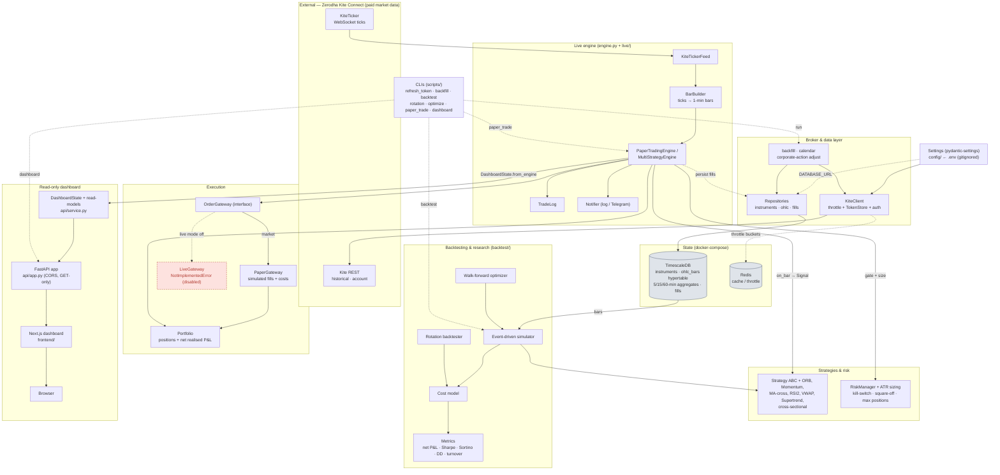
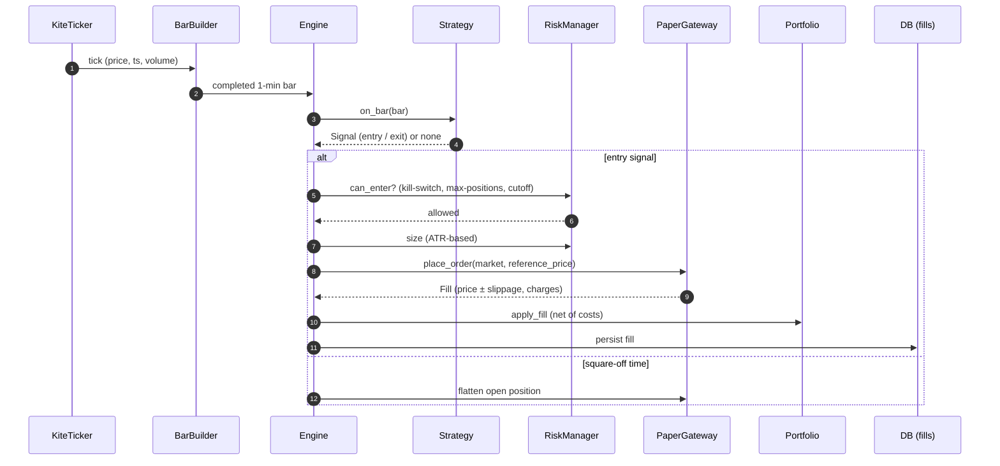
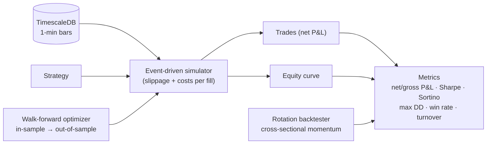

# Architecture

A **local-first, paper-only** algorithmic-trading system for Indian equities on
Zerodha Kite Connect. The guiding principles:

- **One `Strategy` codebase** drives backtests *and* live paper-trading — no
  backtest-vs-live drift.
- **Every P&L is net** of the full Indian cost stack (brokerage, STT, exchange,
  SEBI, GST, stamp duty) plus slippage.
- **No real orders, ever** — `LiveGateway` is a stub that raises
  `NotImplementedError`; only `PaperGateway` executes.
- **Secrets never touch git** — read via `pydantic-settings` from a gitignored
  `.env`.

A rendered image of the diagram below lives at
[`docs/architecture.png`](./architecture.png) (source:
[`architecture.dot`](./architecture.dot)).

## System overview

## Flow 1 — Live paper-trading

The engine is the **only** component that touches a gateway; swapping
`PaperGateway` for `LiveGateway` is the paper→live switch (and live stays
stubbed).

## Flow 2 — Backtesting & optimization

Research reuses the **same** `Strategy` and cost model as live, so results carry
over without drift.

## Layer responsibilities

| Layer | Package | Responsibility |
|---|---|---|
| Config | `config/` | Typed settings from `.env` (secrets never hardcoded) |
| Broker | `broker/` | Kite REST wrapper, token-bucket throttle, daily token refresh |
| Data | `data/` | TimescaleDB models, repositories, backfill, calendar, corp-actions |
| Strategies | `strategies/` | `Strategy` ABC + implementations; pure decision logic |
| Backtest | `backtest/` | Simulator, cost model, metrics, rotation, walk-forward |
| Risk | `risk/` | ATR sizing, daily-loss kill-switch, square-off, max positions |
| Execution | `execution/` | `OrderGateway` → `PaperGateway` / `LiveGateway` (stub), `Portfolio` |
| Live | `live/` | Tick→bar aggregation, notifier, trade log, KiteTicker feed |
| Engine | `engine.py` | `PaperTradingEngine`, `MultiStrategyEngine` (shared risk budget) |
| API | `api/` | Read-only FastAPI dashboard service + app |
| Frontend | `frontend/` | Next.js dashboard (separate Node app over the API) |

## Safety boundaries

- **`LiveGateway`** raises `NotImplementedError` — paper is the only execution
  path until live is deliberately enabled (needs a registered static IP).
- **Costs are mandatory** and centralised in `backtest/costs.py`; the simulator
  and `PaperGateway` both apply them, so reported P&L is always net.
- **Secrets** are read via `pydantic-settings` from a gitignored `.env`;
  `gitleaks` runs on every commit and in CI.
- **Stateful services** (TimescaleDB, Redis) run via `docker-compose`; the
  Python engine runs on the host.
